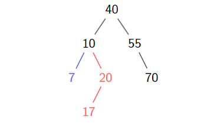
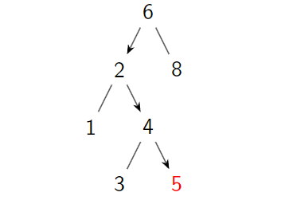

# 1. binary search tree

Relational Database

A Cartesian product of the fields.

## 1.1. We need key first

- Record R_i = (x_i, ...)
- Search Key X_i (distinct)
- for all the keys in the left subtree are smaller than key value in x
- for all right key are larger than the key value x
- Kinda different from heap
  - It is not complete
  - It has to have distinct value

## 1.2. How to handle this data structure

### BST find

Left side is always smaller and right side is always bigger. So finding 5 will have to go left from root and go on

Time complexity for when having the node of n

$O(\log n)$

Also we know that depth d = $\theta(\log n)$ in full binary tree

So when complete only need $\theta(\log n)$
When the target node is in the edge also the tree shape is like a line then the worst case `n`

### BST Insert

GO down one by one and if there is a matching place and if it is empty subtree then insert

### BST Delete

### BST Delete

- No child
  - Just delete
- 1 child
  - Replace the node with its subtree
- 2 children
  - Replace the node with its in-order predecessor or in-order successor, then delete the predecessor/successor

Quiz

| Data Structure | Search   | Insert   | Delete   |
| -------------- | -------- | -------- | -------- |
| Heap           | O(n)     | O(log n) | O(log n) |
| BST Ave        | O(log n) | O(log n) | O(log n) |
| BST worst      | O(n)     | O(n)     | O(n)     |
| Array          | O(n)     | O(n)     | O(n)     |
| LinkedList     | O(n)     | O(1)     | O(1)     |
