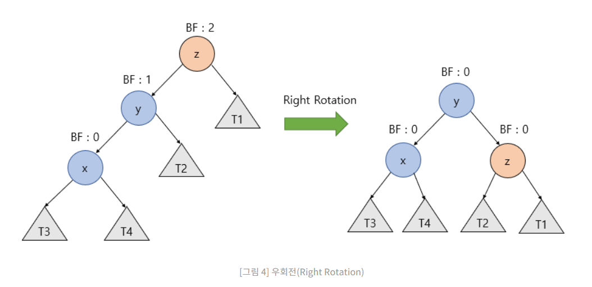
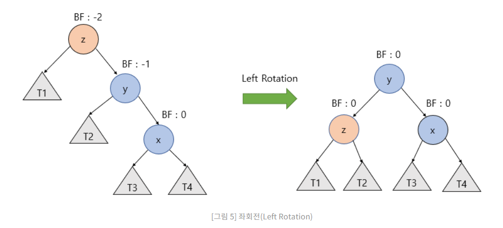
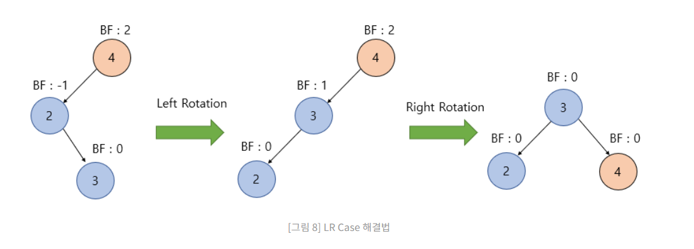
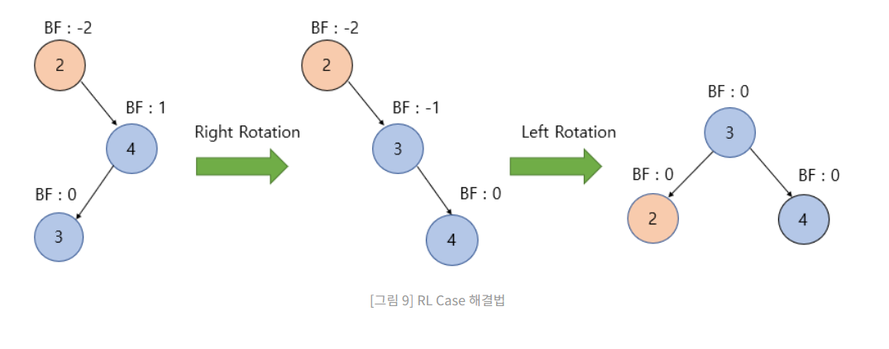

# AVL tree

For every node the depths of the left subtree and right subtree differ at most 1

The balance factor Must be between -1, 0, 1

After operation it needs to be done some re-balance

## Re balancing the AVL tree

Right Rotation



When the Right is the deepest (LL)

1. change the right child of y to z node
2. change the left child of z to y nodes right subtree

Left Rotation



When the Left is the deepest(RR)

1. change the left child of y to z node
2. change the right child of z to y nodes left subtree

LR Case



Do Right rotation at the subtree of the inbalance node
The operate Left Rotation at the inbalance node

RL Case



Case can be done same as LR just opposite Rotation.

### AVL Tree simulator

If not understanding well you can use visualization tool

[AVL simulaor](https://www.cs.usfca.edu/~galles/visualization/AVLtree.html)

### Sample code

```c
// Right Rotation
Node* rightRotate(Node* y) {
  Node* x = y->left;
  Node* T2 = x->right;

  // Perform rotation
  x->right = y;
  y->left = T2;

  // Update heights
  y->height = max(height(y->left), height(y->right)) + 1;
  x->height = max(height(x->left), height(x->right)) + 1;

  // Return new root
  return x;
}
```

```c
// Left Rotation
Node* leftRotate(Node* x) {
  Node* y = x->right;
  Node* T2 = y->left;

  // Perform rotation
  y->left = x;
  x->right = T2;

  // Update heights
  x->height = max(height(x->left), height(x->right)) + 1;
  y->height = max(height(y->left), height(y->right)) + 1;

  // Return new root
  return y;
}
```

```c
// Check balance factor and perform rotation if needed
Node* balance(Node* root, int key) {
  // Calculate balance factor
  int balanceFactor = getBalanceFactor(root);

  // Left rotation
  if (balanceFactor > 1 && key < root->left->key) {
    return rightRotate(root);
  }

  // Right rotation
  if (balanceFactor < -1 && key > root->right->key) {
    return leftRotate(root);
  }

  // Left-Right rotation
  if (balanceFactor > 1 && key > root->left->key) {
    root->left = leftRotate(root->left);
    return rightRotate(root);
  }

  // Right-Left rotation
  if (balanceFactor < -1 && key < root->right->key) {
    root->right = rightRotate(root->right);
    return leftRotate(root);
  }

  // No rotation needed, return the original root
  return root;
}
```

```c
// GetBalance
int getBalanceFactor(Node* node) {
  if (node == NULL) {
    return 0;
  }
  return height(node->left) - height(node->right);
}
```

```c
//height
int height(Node* node) {
  if (node == NULL) {
    return 0;
  }
  return node->height;
}
```

```c
// AVL Node data type
typedef struct Node {
  int key;
  struct Node* left;
  struct Node* right;
  int height;
} Node;
```

When Inserting and Deleting should Update the height of the nodes.

Here is full explanation and Code for AVL Tree

[AVL TREE explained](https://www.programiz.com/dsa/avl-tree)
